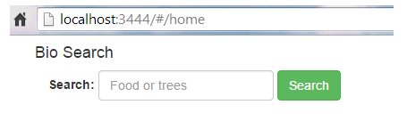
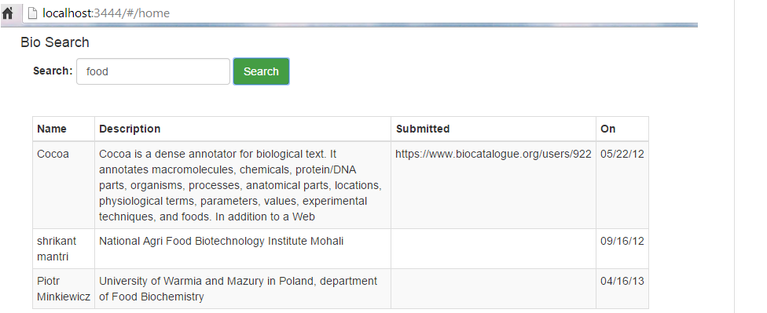
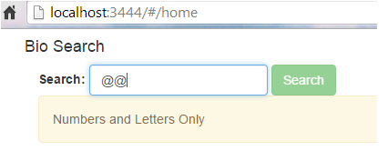
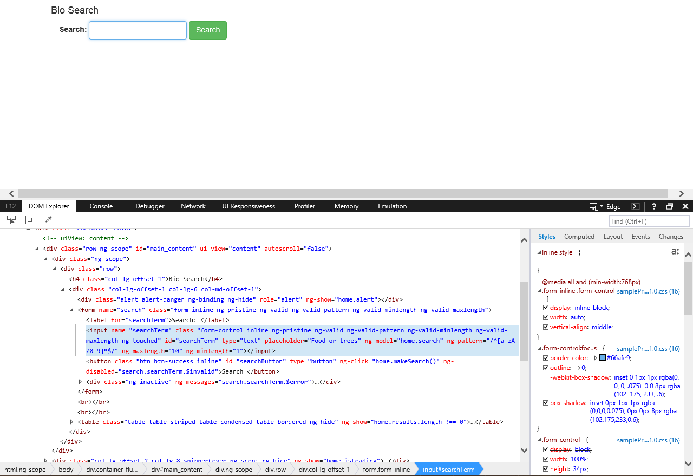
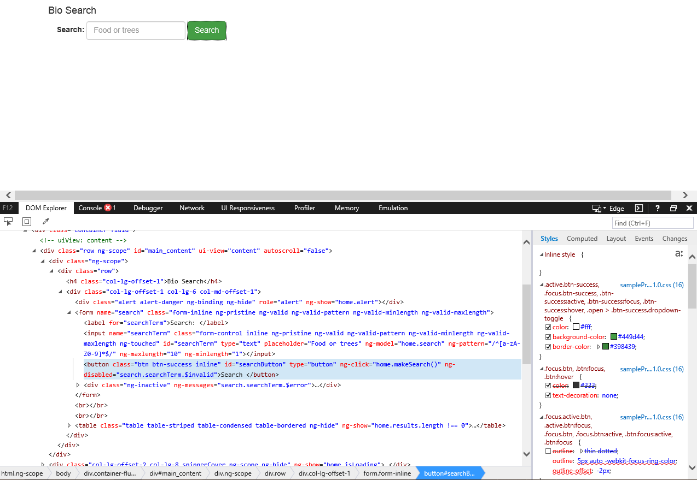

# Inside Protractor Locators

by @amad410 and @mbcooper


## Project Setup
  This is the same setup as [https://github.com/mbcooper/ProtractorExample](https://github.com/mbcooper/ProtractorExample "our Protractor Introduction")

1. Clone this repo.
1. Install Node.js® if you haven't already. See more on [official Node.js® website](http://nodejs.org/).
    
    On OS X you can install Node.js® just by typing
    
    ```
    brew update
    brew install node
    ```
    
    Don't have Homebrew on OS X? 
    
    ```
    ruby -e "$(curl -fsSL https://raw.githubusercontent.com/Homebrew/install/master/install)"
    ```
    
    More on official [Homebrew website](http://brew.sh/).
    
1. Install node global dependencies 
	
	```
	npm install -g gulp-cli
	npm install -g bower
	npm install -g jscs
	npm install -g protractor
	```
	
1. In the directory where you placed the project, install all project's dependencies

	```
	npm install
	bower install
	```

1. You need to update selenium webdrivers

	```
	webdriver-manager update
	```

1. Finally, run project by typing

    ```
    gulp
    ```

## Understanding Locators
Locators are functions that will help protractor grab the specific element that you want from an applications DOM.  By now, you might have already started sifting through numerous sites on protractor locators.  You might have also experimented with them and discovered that the documentation out there for locators are either outdated due to new protractor versions or various implementations for what you are trying to achieve just do not work. We are going dive into what does and does not work, depending upon what you are trying to do. Last, we will show some real world examples.   Before we get started on those topics, let's start off describing the different types of locators.  

Every protractor locator is formatted as (by.*), where * is the locator you have chosen to locate the element. Here is a list of the most common locators:

* **_by.binding("{{status}}")_**
* **_by.model("{{ng-model parameter}}")_**
* **_by.css("{{css locator}}")_**
* **_by.buttonText("{{button text}}")_**
* **_by.repeater("{{repeating lists}}")_**
* **_by.id("{{element ID}}")_**
* **_by.linkText("{{link text}}")_**
* **_by.name("{{element name}}")_**
* **_by.tagName("{{element tagname}}")_**
* **_by.xPath("{{xpath}}")_**
* **Finding Child Elements**

#### Binding
  This locator will find an element by its text binding. Any element bound to variables containing the text or having an **ng-bind** angular directive will be returned.  Check out the _div_ and the _span_ tags below.  It shows two ways in which a binding description is applied to an element.  
  ```
  <div>{{name}}</div>
  <span ng-bind="person.email"></span>
  ```
  Using the _binding_ locator, it will locate the element based on description and return the _div_ and/or _span_ for you.  
  ```
  by.binding('name');
  by.binding('person.email')
  ```
#### Model
  This locator will find an element by its **ng-model** angular directive.  
   ```
  <input type="text" ng-model="person.name">
  ```
  Finding an element by its model is the most common locator.  Finding an element based on a decription that binds it to the data it represents is as easy as
   ```
  by.model('person.name')
  ```
#### CSS
  This locator will find an element using CSS selectors.
   ```
  <div class="primary.header">
  <input placeholder="Property Address">
  ```
  The _div_ specified above can be found using the css class selector, where the **.** used to find an element by its css class.  
   ```
  by.css('.primary')
  ```
  The _input_ element can be found by first identifying the HTML tag, and then following that up with its attribute enclosed in brackets and attribute value enclosed in quotes as specified below:
  ```
  by.css('input[placeholder="Property Address"]')
  ```
  I would like to mention there are many other variations of CSS selectors. I often use the _$_ as a shorthanded version of _element(by.css(''))_.  Using this variation of the locator, I can search for the same element by performing the following:
   ```
  $('input[placeholder="Property Address"]')
  ```
  or search for an element by its ID or class
   ```
  $('#someid');
  *('.class');
  ```
  Lastly, you can find elements based on css matching some text.  
  ```
  <li class="pet">Dog</li>
  ```
  ```
  by.cssContainingText('.pet', 'Dog'))
  ```
  The example shows how you can find an element based on its css class matching the text 'Dog.'
  
#### ButtonText
  This locator will find a button element based on its text.  
  ```
  <button>Save</button>
  <button>Go To Next Page</button>
  ```
  As you can see above, the two buttons have the text 'Save' and 'Go To Next Page.'  We can find these elements by performing the following:
   ```
  by.buttonText('Save')
  by.partialButtonText('Next')
  ```
  The latter example finds a button that matches some partial text.  
#### Repeater
  This locator helps us find elements inside an **ng-repeat** angular directive.  This directive clones HTML elements once for each item in a collection (in an array).
  ```
  <div ng-repeat="cat in pets">
  <span>{{cat.name}}</span>
  <span>{{cat.age}}</span>
  </div>
  ```
  Using _repeater_ locator, we can find an array of elements inside the repeater
  ```
  by.repeater('cat in pets')
  ```
  Or we can narrow down our choice within the collection elements by either column or row. Here are the different permutations:
  ```
  by.repeater('cat in pets').column('cat.name')
  by.repeater('cat in pets').row(1)
  by.repeater('cat in pets').row(0).column('cat.name')
  ```
  Keep in mind that the first example will returns a promise that resolves to an array of WebElements from a column.  In essence, you will get the collection.  Therefore, it is necessary that you store the elements that you get back as a collection like so:
  ```
  element.all(by.repeater('cat in pets').column('cat.name')
  ```
#### ID
  Using IDs is the one of the most common ways to find elements, when there is in fact one for an element. However, this unique identifier is not always there for an element. When you do have an ID, you can perform the following two ways:
  ```
  by.id('loginButton')
  $('#loginButton')
  ```
#### LinkText
  For all links, you can use this locator to find those that match targeted text.  
  ```
  <a href="default.asp" target="_blank">This is a link</a>
  ```
  ```
  by.linkText('This is a link')
  by.partialLinkText('link')
  ```
  Once again, the latter example finds a link that matches some partial text.  
#### Name
  This locator finds an element based on its name.  
  ```
  <form name=myform>
  ```
  ```
  by.name('myForm')
  ```
#### TagName
  This is another common locator, which finds an element based on its tag (a, h2, input, button, etc.).
  ```
  <h2>Hello</h2>
  ```
  ```
  by.tagName('h2')
  ```
#### xPath
  This locator is not used all that often.  The reason being is that for new development you cannot rely on the exact location of an element in the DOM.  It would make more sense to use this locator when the application is stable and mature. However, it is not recommended to use this locator.  What sets Protractor apart from other automation tools are the powerful locators, other than xPath, that have been provided to you to find elements within an Angular application. On other hand, if you want to find an element by xPath you can. 
  ```
  <div id="numDispBox" ng-mouseleave="hideNumDisplayBox()" style="display: none;">
  	<div class="numDispOption transition_2" ng-click="UpdateNbResultPerNode(20)">20</div>
  	<div class="numDispOption transition_2" ng-click="UpdateNbResultPerNode(40)">40</div>
  	<div class="numDispOption transition_2" ng-click="UpdateNbResultPerNode(60)">60</div>
  	<div class="numDispOption transition_2" ng-click="UpdateNbResultPerNode(80)">80</div>
  </div>
  ```
  To find the third child div under the parent, you can perform the folllowing by referencing its text in xPath:
  ```
  by.xPath("//div[text()='60']")
  ```
#### Finding Child Elements
  Lastly, lets look at some other ways to find elements.  You may want to find certain elements within a parent element. For example, take a look at the code below:
   ```
  <div id="numDispBox" ng-mouseleave="hideNumDisplayBox()" style="display: none;">
  	<div class="numDispOption transition_2" ng-click="UpdateNbResultPerNode(20)">20</div>
  	<div class="numDispOption transition_2" ng-click="UpdateNbResultPerNode(40)">40</div>
  	<div class="numDispOption transition_2" ng-click="UpdateNbResultPerNode(60)">60</div>
  	<div class="numDispOption transition_2" ng-click="UpdateNbResultPerNode(80)">80</div>
  </div>
  ```
  If you wanted to find the _div_ tags inside the parent _div_, you could chain the css selectors by specifying both the parent and child tage names. Since there are multiple elements that have the same tag name, it is best to perform the following:
  
  Locator | Description |
--- | --- | ---
$('div div').first() | Selects first of children |
$('div div').last() | Selects last of children | 
$('div div').get(index) | Selects index-th of children | 

## Good Versus Bad Locators
After developing tests using Protractor for AngularJS webapps, I have found that best protractor locators are:

Stil TBD

## Applying This In Real World
By now, you are probably excited that you have found a one-stop shop on protractor locators.  There are many sites out there that list different implementation of using locators, but they are not as thorough or up to date.  In addition, not all examples are practical.  The focus of this section will be in using protractor locators to find elements in a real-world application. Go to the [Protractor Example project] (https://github.com/mbcooper/ProtractorExample), clone the repo, and launch the example application.  

This is a very simple application that has a seach box, which accepts only two valid terms as inputs: **Trees** and **Food**.  The user is able to search these terms and return results by entering them into the search box, and clicking the search button. Results will be displayed in a table below the search.    





Validations are also performed, based on simple rules, to handle invalid searches. The terms searched for must have alpha characters only, and must be no more than 10 characters.  



For the purpose of applying protractor locators, we are going to check the following:

1. Verify that certain elements are presented on the page
2. Verify we receive results back from searching with valid terms
3. Verify we received validations when providing invalid inputs into the search box

#### Verify that certain elements are presented on the page
##### Reading DOM Elements

   See section titled 'Home.po.js - Our Page Object' in the [Protractor Example](https://github.com/mbcooper/ProtractorExample).  A page object is a design pattern for creating an object repository for UI elements.  Under this design pattern, each web page has a corresponding page class which identifies elements and their properties, methods, and the available operations that can be performed by the elements.  We will be creating elements and methods to interact with the elements inside its corresponding page object class **Home.po.js.**.  Let's examine the DOM for the search box.  

  

  From the image above we can visually see that the search box element has an input tag.  Since we are using protractor locators we need to find an angular directive that we can use. In this case, we can find an element by its **ng-model** angular directive within the input tag.  
  ```
  <input type="text" class="form-control inline ng-pristine ng-valid ng-valid-pattern ng-valid-minlength ng-valid-maxlength ng-touched" name="searchTerm" ng-minlength="1" ng-maxlength="10" ng-pattern="/^[a-zA-Z0-9]*$/" ng-model="home.search" id="searchTerm" placeholder="Food or trees">
  ```
Therefore, we can write the code to identify the search box in the page object class **Home.po.js.** as: 
```
searchBox: {
    get: function() {
      return element(by.model('home.search'));
    }
  },
```
 Alternatively, we can find this element by id, name, or by css:
```
searchBox: {
    get: function() {
      return element(by.id('searchTerm'));
    }
  },
```
```
searchBox: {
    get: function() {
      return element(by.name('searchTerm'));
    }
  },
```
```
searchBox: {
    get: function() {
      return element(by.css('[placeholder="Food or trees"]'));
    }
  },
```
  Let's examine the DOM for the search button.  

  

From the image above we can visually see that the search button element has a button tag that does not contain an **ng-model** angular directive.  Therefore, we need to find other locators for which to identify this element.  What we do see is that there is an **id** and **ng-click** css attribute.  Therefore, we can identify the search button element using either one of the locators in our page object:
```
searchButton: {
    get: function() {
      return element(by.id('searchButton'));
    }
  },
```
```
searchButton: {
    get: function() {
      return element(by.css('[ng-click="home.makeSearch()"]'));
    }
  },
```
##### Tests that DOM elements are present
 We can now write tests in our spec to validate that these elements are presented
```
 it('should have a search box', function() {
      var searchBox = homePage.searchBox;
      expect(searchBox.isPresent()).toBe(true);
    });
```
```
 it('should have a search button', function() {
      var searchButton = homePage.searchButton;
      expect(searchButton.isPresent()).toBe(true);
    });
```
#### Verify we receive results back from searching with valid terms


